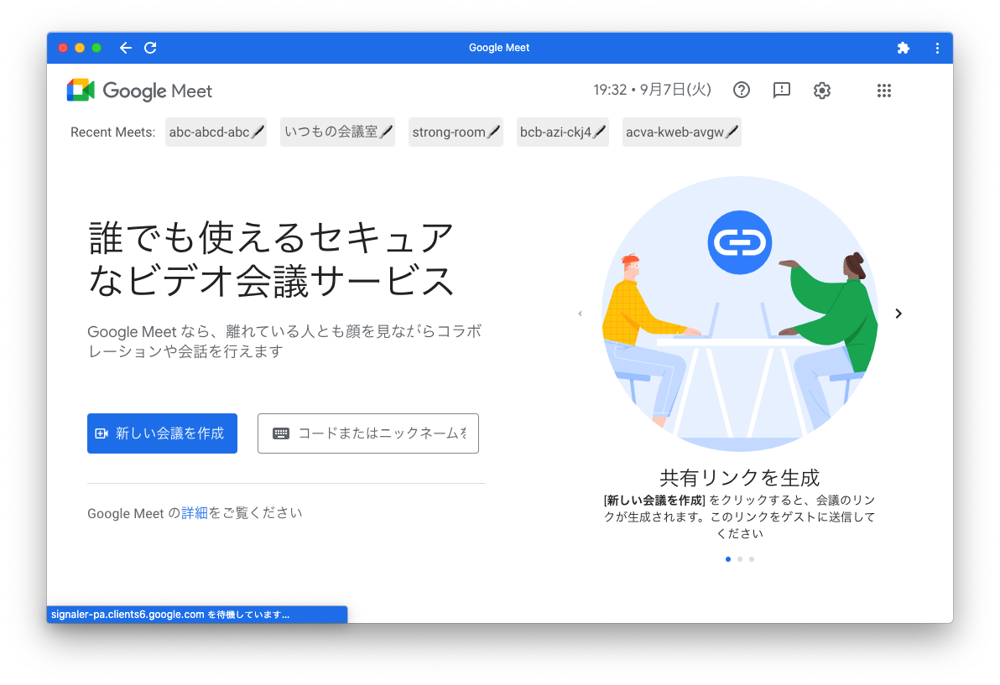

# Recent Meets

Google Meetの最近参加した会議室を表示するChrome拡張

## 機能

- 🖋 をクリックすると会議室に名前をつけることが出来ます。
- 名前のない会議室はidで表示されます。

## 使い方

1. `chrome://extensions/` にアクセスし、右上のデベロッパーモードを有効化
2. このリポジトリをダウンロードし、「パッケージ化されていない拡張機能を読み込む」からこのリポジトリのディレクトリを選ぶ

`https://meet.google.com` や `https://meet.google.com/landing` にアクセスすると、画面上部に「Recent Meet」バーとして、最近参加した会議室へのリンクが表示されます。

